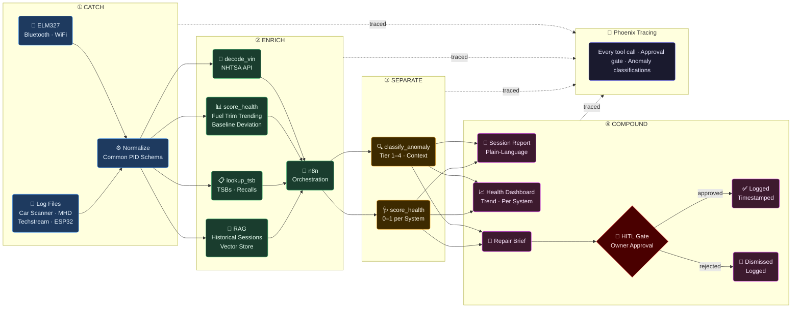

# Architecture
*MisfireAI · May 2026*

---

## Pipeline



---

## Data Sources → Common Schema

All ingestion sources normalize to the same structure before enrichment:

```json
{
  "vehicle_id":  "string  — VIN or assigned ID",
  "session_id":  "string  — unique per run",
  "timestamp":   "ISO 8601",
  "source":      "elm327 | car_scanner | mhd | techstream | esp32 | dragy | sample",
  "pids": [
    { "pid": "0x0C", "name": "RPM", "value": 1423.5, "unit": "rpm", "raw_hex": "1640" }
  ],
  "dtcs":         ["P0420"],
  "pending_dtcs": ["P0171"],
  "mode06": [
    { "monitor_id": "CAT_B1S1", "measured": 0.91, "min": 0.90, "max": 1.10, "margin": 0.05 }
  ],
  "context": {
    "coolant_temp_c":    92,
    "run_time_sec":      480,
    "drive_cycle_state": "cruise"
  }
}
```

> `mode06` is optional — present only when the hardware and vehicle support it. See [Predictive Health Scoring](#predictive-health-scoring) for how scoring works with and without it.

---

## Predictive Health Scoring

MisfireAI uses **three scoring methods** in priority order depending on available data. All three produce a 0–1 health score per system — the approach adapts to what the hardware can provide.

### Method 1 — Mode 06 Margin Scoring *(best, hardware-dependent)*
When Mode 06 data is available, the vehicle's own internal thresholds are used directly:
```
margin = (measured − min) / (max − min)   →   0.0 – 1.0

  0.00 – 0.10  ██████████  Critical  — at or past threshold
  0.10 – 0.25  ████████░░  Warning   — near threshold, predictive signal
  0.25 – 0.75  ████░░░░░░  Normal
  0.75 – 1.00  ██░░░░░░░░  Healthy
```
A catalyst at 91% of its minimum threshold looks fine to a standard scanner. MisfireAI flags it. **Requires hardware that can pull Mode 06** — not all adapters or vehicles support this reliably. Under active research (see Hardware section).

### Method 2 — Fuel Trim Trending Across Sessions *(core method, works on any hardware)*
LTFT creeping from +3% → +7% → +11% across 20 sessions is a leading indicator weeks before a DTC. No special hardware required — Mode 01 PIDs only. This is the primary predictive method for Part 1.
```
trend_score = 1 − (current_ltft / saturation_limit)
drift_rate  = slope of LTFT over last N sessions
```

### Method 3 — Statistical Baseline Deviation *(fallback, first-session capable)*
Compare current session readings to the vehicle's personal baseline. Coolant temp running 8°C cooler than 30-session average at matching RPM/ambient → thermostat degrading. Works from session one using population statistics.
```
deviation_score = 1 − (|current − baseline_mean| / baseline_std)
```

---

## Severity Tiers

| Tier | Trigger | Behavior |
|:---:|---|---|
| **1 — Immediate** | Single reading crosses critical threshold | Alert instantly — no pattern required |
| **2 — Pattern** | 2+ related sensors deviating together in a session | Correlate before flagging |
| **3 — Persistence** | Same reading degrading across multiple sessions | Leading wear indicator — requires historical baseline |
| **4 — Cliff Drop** | Normal → limit in a single session | Sensor failure, wiring fault, or acute component failure |

---

## Hardware Inventory

Tested and documented hardware for live data capture. Goal: build a replicable stack using cheap, off-the-shelf components so anyone can run MisfireAI affordably.

| Device | Type | Protocol | Status | Mode 06 | Notes |
|---|---|---|---|---|---|
| **BMW K+DCAN Cable** | Hard cable | K-Line / D-CAN | ✅ Tested | ✅ Possible | BMW-specific; works with INPA, NCS Expert, ISTA |
| **Mini VCI Cable + Techstream** | Hard cable | Toyota CAN / K-Line | ✅ Tested | ✅ Possible | Toyota/Lexus-specific; Techstream exposes deep manufacturer data |
| **MHD Orange Dongle** | Wireless | BMW-proprietary CAN | ✅ Tested | ✅ Yes | BMW N54/N55/S55/B58; high-frequency logging; primary data source |
| **Zurich BT1 (Harbor Freight)** | Bluetooth | ELM327 / OBD2 | ✅ Tested | ⚠️ Limited | Generic OBD2; works with Car Scanner and python-obd; Mode 06 reliability varies by vehicle |
| **Dragy OBD2 Logger** | Bluetooth | High-freq OBD2 | 🔜 Arriving | ❓ TBD | 10–50 Hz logging; testing pending; Mode 06 capability to be confirmed |
| **ESP32 + CAN Transceiver** | DIY hardware | Raw CAN bus | 🔬 Research | ✅ Possible | Target for affordable replicable build; direct CAN access bypasses ELM327 limitations |

### Hardware Research Goals
- **Mode 06 via Zurich BT1:** Test whether reliable Mode 06 pulls are achievable with ELM327-based adapters on different vehicles
- **Dragy Mode 06:** Confirm whether Dragy exposes Mode 06 or Mode 01 only
- **Third-party apps + Zurich BT1:** Evaluate Car Scanner, Torque Pro, OBD Fusion for Mode 06 support with the BT1 dongle
- **ESP32 target build:** Cheap components (~$15–25 total) that can pull raw CAN + Mode 06; replicable by anyone

---

## Failure Modes & Fallbacks

| Failure | Fallback |
|---|---|
| Hardware connection loss | Prompt for log file ingestion |
| Mode 06 unavailable (adapter or vehicle limitation) | Fall back to fuel trim trending (Method 2) or baseline deviation (Method 3) |
| VIN decode fails | Generic Mode 01 thresholds — flagged in output |
| TSB lookup returns nothing | Analysis continues — absence noted in report |
| No historical sessions | First-run baseline established from current session |
| LLM API unavailable | Raw scored PID data returned — no plain-language output |
| n8n unreachable | Direct tool calls — orchestration layer degrades gracefully |

---

## Bottlenecks

| Concern | Mitigation |
|---|---|
| LLM latency in Enrich | Batch per session, not per reading |
| Vector store growth | Session-level embeddings only — not reading-level |
| Mode 06 hardware dependency | Three-method scoring stack — pipeline never blocks on Mode 06 absence |
| Multi-vehicle isolation | Each `vehicle_id` maintains its own baseline |

---

## HITL — Stakes × Reversibility

| Action | Stakes | Reversible | Gate |
|---|:---:|:---:|---|
| Session report | Low | — | None |
| Anomaly classified | Medium | Yes | Auto-logged with reasoning |
| Repair brief | High | No | **Owner approval required** |
| DTC clear (Mode 04) | High | No | **Blocked — out of scope** |
| Third-party data share | High | No | **Blocked — out of scope** |
