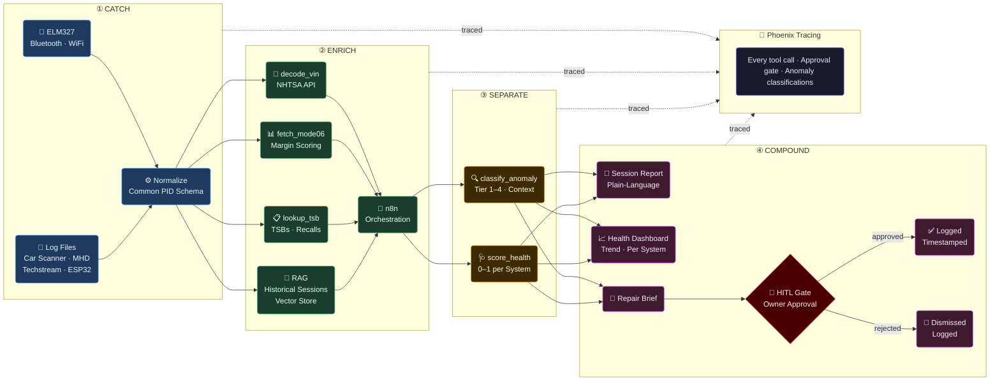

# Architecture
*MisfireAI · May 2026*

---

## Pipeline



---

## Data Sources → Common Schema

All ingestion sources normalize to the same structure before enrichment:

```json
{
  "vehicle_id":  "string  — VIN or assigned ID",
  "session_id":  "string  — unique per run",
  "timestamp":   "ISO 8601",
  "source":      "elm327 | car_scanner | mhd | techstream | esp32 | sample",
  "pids": [
    { "pid": "0x0C", "name": "RPM", "value": 1423.5, "unit": "rpm", "raw_hex": "1640" }
  ],
  "dtcs":         ["P0420"],
  "pending_dtcs": ["P0171"],
  "mode06": [
    { "monitor_id": "CAT_B1S1", "measured": 0.91, "min": 0.90, "max": 1.10, "margin": 0.05 }
  ],
  "context": {
    "coolant_temp_c":    92,
    "run_time_sec":      480,
    "drive_cycle_state": "cruise"
  }
}
```

---

## Mode 06 Health Score

Standard scan tools report pass/fail. MisfireAI captures the **margin** — the continuous score the vehicle is already computing internally. A catalyst at 91% of its minimum threshold is not the same as one at 60%. Both "pass." Only one is a week from a DTC.

```
margin = (measured − min) / (max − min)   →   0.0 – 1.0

  0.00 – 0.10  ██████████  Critical  — at or past threshold
  0.10 – 0.25  ████████░░  Warning   — near threshold, predictive signal
  0.25 – 0.75  ████░░░░░░  Normal
  0.75 – 1.00  ██░░░░░░░░  Healthy
```

---

## Severity Tiers

| Tier | Trigger | Behavior |
|:---:|---|---|
| **1 — Immediate** | Single reading crosses critical threshold | Alert instantly — no pattern required |
| **2 — Pattern** | 2+ related sensors deviating together in a session | Correlate before flagging |
| **3 — Persistence** | Same reading degrading across multiple sessions | Leading wear indicator — requires historical baseline |
| **4 — Cliff Drop** | Normal → limit in a single session | Sensor failure, wiring fault, or acute component failure |

---

## Failure Modes & Fallbacks

| Failure | Fallback |
|---|---|
| ELM327 connection loss | Prompt for log file ingestion |
| Mode 06 data unavailable | Statistical deviation from session baseline |
| VIN decode fails | Generic Mode 01 thresholds — flagged in output |
| TSB lookup returns nothing | Analysis continues — absence noted in report |
| No historical sessions | First-run baseline established from current session |
| LLM API unavailable | Raw scored PID data returned — no plain-language output |
| n8n unreachable | Direct tool calls — orchestration layer degrades gracefully |

---

## Bottlenecks

| Concern | Mitigation |
|---|---|
| LLM latency in Enrich | Batch per session, not per reading |
| Vector store growth | Session-level embeddings only — not reading-level |
| Sparse Mode 06 data | Partial scoring valid — missing monitors noted, not blocking |
| Multi-vehicle isolation | Each `vehicle_id` maintains its own baseline |

---

## HITL — Stakes × Reversibility

| Action | Stakes | Reversible | Gate |
|---|:---:|:---:|---|
| Session report | Low | — | None |
| Anomaly classified | Medium | Yes | Auto-logged with reasoning |
| Repair brief | High | No | **Owner approval required** |
| DTC clear (Mode 04) | High | No | **Blocked — out of scope** |
| Third-party data share | High | No | **Blocked — out of scope** |
