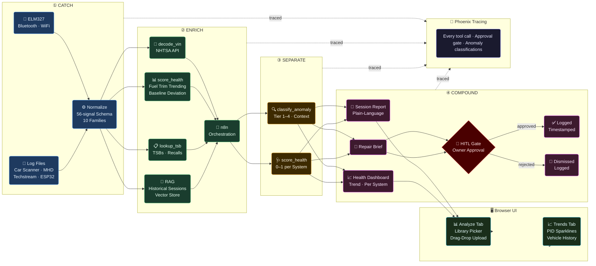

# Architecture
*MisfireAI · May 2026*

---

## Pipeline



---

## Data Sources → Common Schema

All ingestion sources normalize to the same 56-signal canonical schema across 10 signal families before enrichment.

**Supported sources (auto-detected from column headers):**

| Source | Format | Vehicles | Notes |
|---|---|---|---|
| **MHD** | CSV, semicolon or comma | BMW N54/N55/S55/B58 | High-freq performance logging; AFR wideband, per-cylinder timing, WGDC, knock retard |
| **CarScanner** | CSV | Any OBD2 | Verbose English headers with ℉ / mph units |
| **CarOBD** | CSV | Toyota Etios (tested) | UPPERCASE headers with empty unit suffix `ENGINE_RPM ()` |
| **CephaSAX** | CSV, semicolon | Multi-make Brazil fleet | Mixed-case fuel trim names; European decimal format (`79,20%`); values with unit suffixes (`82C`) |
| **iSay Gerard** | CSV, semicolon | KIA Soul | Spanish headers with bracket units `[rpm]`; wideband O2 + catalyst temp |

**Canonical schema (normalized output):**

```json
{
  "vehicle_id":  "string  — VIN or assigned ID",
  "session_id":  "string  — unique per run",
  "timestamp":   "ISO 8601",
  "source":      "elm327 | car_scanner | mhd | techstream | esp32 | dragy | carobd | cephasax | isay_gerard",
  "pids": [
    { "pid": "0x0C", "name": "RPM", "value": 1423.5, "unit": "rpm", "raw_hex": "1640" }
  ],
  "dtcs":         ["P0420"],
  "pending_dtcs": ["P0171"],
  "mode06": [
    { "monitor_id": "CAT_B1S1", "measured": 0.91, "min": 0.90, "max": 1.10, "margin": 0.05 }
  ],
  "context": {
    "coolant_temp_c":    92,
    "run_time_sec":      480,
    "drive_cycle_state": "cruise"
  }
}
```

**Signal families (10 total, 56 canonical signals):**

| Family | Key Signals |
|---|---|
| fueling | STFT_B1/B2, LTFT_B1/B2, AFR_B1/B2, O2_LAMBDA_B1S1 |
| ignition | TIMING_ADV, TIMING_CYL1–6, KNOCK_RETARD |
| thermal | ECT, IAT, OIL_TEMP, TRANS_TEMP, EGT, AMB_TEMP |
| boost | BOOST_ACTUAL, BOOST_TARGET, MAP, WGDC_B1/B2 |
| catalyst | CAT_TEMP_B1S1/B2, O2_VOLT_B1S2, O2_CURRENT_B1S1 |
| fuel_supply | MAF, MAF_REQ, FUEL_PRESSURE, FUEL_RAIL_PSI, ETHANOL_PCT |
| exhaust | MIL_DISTANCE, DTC_COUNT |
| composition | FUEL_INTERP, FUEL_MODE |
| drivetrain | RPM, VSS, LOAD, THROTTLE, GEAR, TORQUE_ACTUAL, RUN_TIME |
| meta | ACCEL_PED, AMB_PRESSURE, OIL_PRESSURE_NXM |

**Normalization rules:**
- All temperatures stored in °C (MHD and CarScanner °F inputs converted on ingest)
- Speeds stored in km/h (mph inputs converted)
- MAP stored in kPa (PSI inputs converted)
- Boost and rail pressure kept in PSI (BMW-native)
- European decimal commas (`79,20`) normalized to `.` on ingest
- Trailing unit suffixes (`82C`, `100kPa`) stripped before float parsing
- UTF-8 BOM handled transparently

> `mode06` is optional — present only when the hardware and vehicle support it.

---

## Session Store

All ingested sessions are persisted to a local SQLite database (`data/sessions.db`) as `SessionRecord` objects for longitudinal trend analysis.

**Schema:** `session_id`, `vehicle_id`, `source`, `file_path`, `file_name`, `recorded_at`, `ingested_at`, `row_count`, `pids_present`, `families_present`, `pid_stats` (mean/min/max/last/std per PID), `dtcs`, `warnings`, `session_meta`, `overall_score`, `system_scores`

**Sessions ingested (Part 1):**

| Vehicle | Source | Sessions | Date Range |
|---|---|---|---|
| bmw-335i-IJE0S | MHD | 394 | 2023–2026 |
| toyota-etios | CarOBD | 142 | — |
| cephasax-fleet | CephaSAX | 7 | — |
| kia-soul | iSay Gerard | 4 | — |
| **Total** | | **548** | |

**MHD filename parsing:** Vehicle ID, tune version, fuel mix, and session timestamp are parsed directly from MHD filenames:
```
2026-03-04 12_16_26 IJE0S FF v10.0 stg 2+ a91_c94AT_ALP.csv
→ vehicle_id: IJE0S, tune: FF v10.0 stg 2+, fuel_mix: a91_c94, recorded_at: 2026-03-04T12:16:26
```

---

## MCP Tools

Six atomic tools exposed via the Model Context Protocol server (`tools/mcp_server.py`). The agent invokes these; each is independently observable in Phoenix traces.

| Tool | Inputs | Outputs |
|---|---|---|
| `ingest_file` | `file_path`, `source`, `max_rows` | Normalized PID snapshot, families, session_meta, warnings |
| `ingest_batch` | `folder_path`, `source`, `vehicle_id`, `max_files` | Batch summary: processed/errors, families_seen, pid_coverage, date_range |
| `decode_vin` | `vin` | Make, model, year, engine, plant (NHTSA API) |
| `lookup_tsb` | `vin` | Recall count, complaint count, TSB list (NHTSA API) |
| `score_vehicle_health` | Normalized snapshot | Per-system 0–1 scores, scoring method used, anomaly tier |
| `query_trends` | `vehicle_id`, `pid`, `limit` | Longitudinal mean/min/max per session, sorted chronologically |

---

## Predictive Health Scoring

Three scoring methods in priority order. All produce a 0–1 health score per system — the approach adapts to available data.

### Method 1 — Mode 06 Margin Scoring *(best, hardware-dependent)*
Uses the vehicle's own internal OBD2 thresholds directly:
```
margin = (measured − min) / (max − min)   →   0.0 – 1.0

  0.00 – 0.10  ██████████  Critical  — at or past threshold
  0.10 – 0.25  ████████░░  Warning   — near threshold, predictive signal
  0.25 – 0.75  ████░░░░░░  Normal
  0.75 – 1.00  ██░░░░░░░░  Healthy
```
A catalyst at 91% of its minimum threshold looks fine to a standard scanner. MisfireAI flags it.

### Method 2 — Fuel Trim Trending Across Sessions *(core method, any hardware)*
LTFT creeping from +3% → +7% → +11% across 20 sessions is a leading indicator weeks before a DTC. Mode 01 PIDs only.
```
trend_score = 1 − (current_ltft / saturation_limit)
drift_rate  = slope of LTFT over last N sessions
```

### Method 3 — Statistical Baseline Deviation *(fallback, first-session capable)*
Compare current session to the vehicle's personal baseline. Coolant temp running 8°C cooler than 30-session average at matching RPM/ambient → thermostat degrading.
```
deviation_score = 1 − (|current − baseline_mean| / baseline_std)
```

**Additional scoring rules:**
- AFR scored against stoichiometric target (14.7 AFR, healthy range 13.5–15.5)
- KNOCK_RETARD derived as `min(TIMING_CYL1..N)` — worst-cylinder knock across all cylinders
- Scoring method recorded per-system in the trace for auditability

---

## Severity Tiers

| Tier | Trigger | Behavior |
|:---:|---|---|
| **1 — Immediate** | Single reading crosses critical threshold | Alert instantly — no pattern required |
| **2 — Pattern** | 2+ related sensors deviating together in a session | Correlate before flagging |
| **3 — Persistence** | Same reading degrading across multiple sessions | Leading wear indicator — requires historical baseline |
| **4 — Cliff Drop** | Normal → limit in a single session | Sensor failure, wiring fault, or acute component failure |

---

## Browser UI

A FastAPI single-page application (`app.py`) served on port 8000. No build step — vanilla JS, no frontend framework dependencies.

**Run:**
```bash
# Local only
uvicorn app:app --port 8000

# LAN access (phone, tablet on same network)
uvicorn app:app --host 0.0.0.0 --port 8000
```

**Endpoints:**

| Endpoint | Method | Purpose |
|---|---|---|
| `/` | GET | Single-page UI |
| `/api/analyze` | POST (SSE stream) | Run full pipeline, stream `{stage, data}` events |
| `/api/sessions` | GET | Last 20 ingested sessions |
| `/api/sessions/{id}` | GET | Full session record |
| `/api/trends/{vehicle_id}/{pid}` | GET | Longitudinal trend array (up to 500 points) |
| `/api/vehicles` | GET | Vehicle list with session counts |
| `/api/library` | GET | All vehicles + available file paths for library picker |
| `/hitl/approve` | GET | HITL approval callback (tokenized) |
| `/hitl/reject` | GET | HITL rejection callback (tokenized) |

**UI features:**
- **Analyze tab** — Vehicle library picker (dropdown by vehicle → file), drag-drop upload for new files, streaming pipeline results (CATCH → ENRICH → SEPARATE → COMPOUND → HITL), Vehicle History panel with sparklines per PID
- **Trends tab** — Vehicle grid cards, PID selector, full canvas line chart (200+ sessions), drift stats
- Mobile-responsive — tested on phone over local WiFi; layout reflows to single-column scroll

**Pipeline streaming:** Results delivered via Server-Sent Events (SSE). Each stage yields a `data: {stage, data}` event as it completes. The UI renders panels progressively — no waiting for the full pipeline to finish.

---

## Hardware Inventory

| Device | Type | Protocol | Status | Mode 06 | Notes |
|---|---|---|---|---|---|
| **BMW K+DCAN Cable** | Hard cable | K-Line / D-CAN | ✅ Tested | ✅ Possible | BMW-specific; works with INPA, NCS Expert, ISTA |
| **Mini VCI Cable + Techstream** | Hard cable | Toyota CAN / K-Line | ✅ Tested | ✅ Possible | Toyota/Lexus-specific; deep manufacturer data |
| **MHD Orange Dongle** | Wireless | BMW-proprietary CAN | ✅ Tested | ✅ Yes | BMW N54/N55/S55/B58; primary data source; 394 sessions logged |
| **Zurich BT1 (Harbor Freight)** | Bluetooth | ELM327 / OBD2 | ✅ Tested | ⚠️ Limited | Generic OBD2; works with Car Scanner and python-obd |
| **Dragy OBD2 Logger** | Bluetooth | High-freq OBD2 | 🔜 Arriving | ❓ TBD | 10–50 Hz logging; Mode 06 capability TBD |
| **ESP32 + CAN Transceiver** | DIY hardware | Raw CAN bus | 🔬 Research | ✅ Possible | Target ~$15–25 replicable build; bypasses ELM327 limitations |

---

## Failure Modes & Fallbacks

| Failure | Fallback |
|---|---|
| Hardware connection loss | Prompt for log file ingestion |
| Mode 06 unavailable | Fall back to fuel trim trending (Method 2) or baseline deviation (Method 3) |
| VIN decode fails | Generic Mode 01 thresholds — flagged in output |
| TSB lookup returns nothing | Analysis continues — absence noted in report |
| No historical sessions | First-run baseline established from current session |
| Source detection fails | `unknown` source returned with warning — user can override |
| LLM API unavailable | Raw scored PID data returned — no plain-language output |
| n8n unreachable | Direct tool calls — orchestration degrades gracefully |
| HITL timeout (120s) | Pipeline logs timeout event, does not auto-approve |

---

## HITL — Stakes × Reversibility

| Action | Stakes | Reversible | Gate |
|---|:---:|:---:|---|
| Session report generated | Low | — | None — auto-logged |
| Anomaly classified (Tier 1–4) | Medium | Yes | Auto-logged with reasoning and confidence |
| Health score computed | Medium | Yes | Auto-logged |
| **Repair brief** | **High** | **No** | **Owner approval required** |
| DTC clear (Mode 04) | High | No | **Blocked — permanently out of scope** |
| ECU write | High | No | **Blocked — outside technical scope** |
| Data shared externally | High | No | **Blocked without explicit owner consent** |

---

## HITL Approval Flow — Implementation

```
Agent output
    ↓
RepairBrief assembled
  (vehicle, system scores, DTCs, assessment, urgency)
    ↓
SendGrid → HTML email → owner inbox
  (misfire@datronex.net → owner email)
    ↓
Owner clicks Approve or Reject
    ↓
FastAPI callback server (port 8000)
  /hitl/approve?token=  or  /hitl/reject?token=
    ↓
Decision + UTC timestamp logged
  → Phoenix span attribute: hitl.decision, hitl.decided_at, hitl.token
    ↓
Pipeline resumes (or logs timeout after 120s)
```

**Approval email contents:**
- Vehicle year / make / model
- Urgency badge (CRITICAL / HIGH / MEDIUM)
- Per-system health scores table with color coding
- Active DTCs (if any)
- Agent assessment (first 600 chars)
- Approve and Reject buttons (tokenized, single-use)

**Approval channels:**

| Channel | Status | Notes |
|---|---|---|
| **Email (SendGrid)** | ✅ Live | misfire@datronex.net → owner Gmail |
| **Telegram** | 🔜 Planned | Bot message with inline buttons — Part 2 |
| **Slack** | 🔜 Future | Channel message with interactive actions |

**Token security:** Each request generates a `secrets.token_urlsafe(24)` token stored in memory. Tokens are single-use and expire on decision or timeout.

---

## Observability

Every tool call, anomaly classification, health score, and HITL decision is traced via Phoenix/Arize OTel.

| Event | What Is Logged |
|---|---|
| `ingest_file` | Source, row count, PID count, families, warnings |
| `ingest_batch` | Files processed/errored, families seen, pid coverage |
| `decode_vin` | VIN (hashed), decoded make/model/year, NHTSA response |
| `lookup_tsb` | VIN (hashed), recall count, complaint count |
| `score_vehicle_health` | Per-system scores, method used, data gaps |
| `classify_anomaly` | Tier, PIDs flagged, reasoning, confidence |
| `generate_repair_brief` | Brief content, delivery channel, owner decision, timestamp |
| HITL — approved | Approver, timestamp, brief hash |
| HITL — rejected | Rejector, timestamp |
| HITL — timeout | Timestamp, no decision recorded |

Traces are immutable once written.

---

## Bottlenecks

| Concern | Mitigation |
|---|---|
| LLM latency | Batch per session, not per reading |
| Vector store growth | Session-level embeddings only — not reading-level |
| Mode 06 hardware dependency | Three-method scoring stack — pipeline never blocks on Mode 06 absence |
| Multi-vehicle isolation | Each `vehicle_id` maintains its own baseline in the session store |
| Session store growth | SQLite; raw rows not retained indefinitely — 90-day aggregation planned |
| Mobile layout | Responsive CSS — single-column reflow below 760px viewport |
