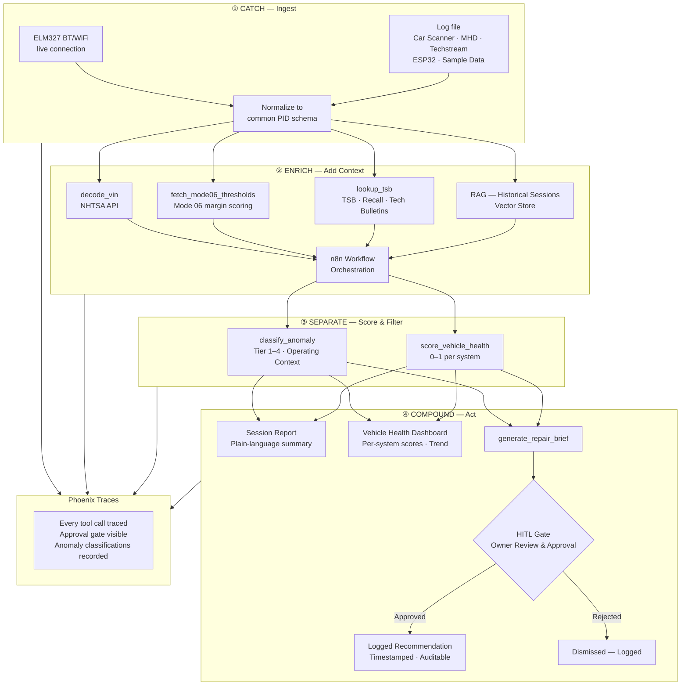

# Architecture
*OBD2 AI Diagnostic Pipeline · Capstone Part 1 · May 2026*

---

## Pipeline Overview



---

## Data Flow — Normalized PID Schema

All ingestion sources output the same schema before enrichment:

```
{
  vehicle_id:    str        # VIN or assigned ID
  session_id:    str        # unique per run
  timestamp:     ISO 8601
  source:        enum       # elm327 | car_scanner | mhd | techstream | esp32 | sample
  pids: [
    { pid: str, name: str, value: float, unit: str, raw_hex: str }
  ]
  dtcs:          [str]      # Mode 03 stored codes
  pending_dtcs:  [str]      # Mode 07 pending codes
  mode06: [
    { monitor_id: str, measured: float, min: float, max: float, margin: float }
  ]
  context: {
    coolant_temp_c: float
    run_time_sec:   int
    drive_cycle_state: enum  # cold_start | warm_up | cruise | idle | decel
  }
}
```

---

## Mode 06 Health Score Formula

```
margin = (measured - min) / (max - min)   → 0.0 – 1.0 per monitor

0.00 – 0.10  →  Critical  (at or past threshold)
0.10 – 0.25  →  Warning   (near threshold — predictive signal)
0.25 – 0.75  →  Normal
0.75 – 1.00  →  Healthy
```

A standard scan tool reports pass/fail. This pipeline captures the margin — a continuous health score the vehicle is already computing internally.

---

## Failure Modes & Fallbacks

| Failure | Fallback |
|---|---|
| ELM327 connection loss | Graceful error → prompt for log file ingestion |
| Mode 06 data unavailable (older vehicle) | Fall back to statistical deviation from session baseline |
| VIN decode fails (NHTSA API down or unknown VIN) | Fall back to generic Mode 01 thresholds — flag in output |
| TSB lookup returns nothing | Continue analysis — note absence in report, no blocking |
| No historical sessions in vector store | First-run baseline established from this session |
| LLM API unavailable | Return raw scored PID data with tier classification — no plain-language output |
| n8n workflow unreachable | Direct tool calls — orchestration layer is degradable |

---

## Bottlenecks & Scaling Considerations

- **LLM latency:** Enrichment calls are the slowest stage. Mitigation: batch PID analysis per session rather than per reading.
- **Vector store growth:** Historical sessions accumulate per vehicle. Mitigation: session-level embeddings (not reading-level) keep index manageable.
- **Mode 06 coverage gap:** Not all vehicles populate all monitors on every drive cycle. The pipeline must handle sparse Mode 06 data gracefully — partial scoring is valid, missing monitors are noted.
- **Multi-vehicle context isolation:** Each vehicle_id maintains its own baseline. Cross-vehicle pattern analysis is a Part 2 feature.

---

## HITL Design — Stakes × Reversibility

| Action | Stakes | Reversibility | Gate |
|---|---|---|---|
| Session report generated | Low | N/A — read only | None |
| Anomaly classified and logged | Medium | Editable | None (auto-logged with reasoning) |
| Repair brief generated | High | Hard to reverse once sent to mechanic | **Owner approval required** |
| DTC cleared (Mode 04) | High | Irreversible | **Out of scope — blocked entirely** |
| Data shared with third party | High | Irreversible | **Out of scope Part 1** |
